# **PROJECT TASKS**

## **Task 1: Evaluate Different SCM Tools**

The Centralized Version Control system (CVCS) has a single “source of truth” server.

A distributed version control system (DVCS) gives every developer a full copy of the repository, including its entire history.

## **Key Differences Between Subversion (SVN) and Git**

- Centralized version control system (SVN) has one repo on server while distributed version control system has full repo on every machine (Git)

- SVN is slower and network-dependent while Git faster and local operations.

- SVN branching is heavier and less flexible while Git is lightweight, fast and core to workflow.

- SVN limited without server access while Git fully functional offline.

- SVN tracks file changes while Git uses cryptographic hashing to ensure strong integrity.

- SVN linear workflow (central authority) while Git flexible workflows (feature branches, forks, pull request).

- SVN downtime can halt development while Git in each clone acts as a backup.

### **Advantages of using Git in a distributed environment over SVN**

- **Speed and performance**; Git is fast because most operations (commit, diff, log) happen locally. There is no need to constantly communicate with a central server, unlike SVN.

- **Offline Capability**; with Git, can commit, branch and review history without internet access

- **Powerful Branching and Merging**; branching in git is lightweight and central to its workflow, which allows multiple features developed simultaneously, easier experimentation without affecting main code, and supports modern workflows like feature branches and pull requests.

- **No single Point of Failure**; Every developer has a full copy of the repository.

- **Flexible Collaboration Models**; Git supports multiple workflows.

- **Strong Data Integrity**; Git uses hashing to track changes.

## **Challenges of Git in a Distributed Environment**

- **Steeper Learning Curve**; Git is not beginner-friendly compared to SVN.

- **Complex Collaboration Management**; Because everyone works independently, coordination becomes critical.

- **Lack of Centralized Control**; unlike SVN, there’s no single “gatekeeper” by default.

- **Repository Size Issues**; Git stores full history locally, while SVN has large repositories (especially with binaries) can become heavy, slower cloning and storage overhead.

- **Security and Access Complexity**; Distributed nature means code exists on multiple machines.

- **Tooling and Workflow Overhead**; to fully benefit from Git, teams often need; code review systems (e.g. Github, GitLab), CI/CD pipelines, Branch protection rules.

## **PROPOSAL TO ADOPT A DISTRIBUTED VERSION CONTROL SYSTEM (Git) FOR MY TEAM DEVELOPMENT**

This report recommends that the team transition from a centralized version control system to a distributed model using Git or a similar DVCS such as Mercurial. The evaluation highlights key benefits including improved performance, offline capability, enhanced collaboration and increased resilience. While challenges such as learning curve and workflow management exist, the overall advantages strongly support adoption, especially for distributed teams.

Version control systems play a critical role in managing code, enabling collaboration, and maintenance project integrity. As development teams become more distributed across locations and time zones, there is a growing need for tools that support asynchronous collaboration and independent workflows. This report outlines why adopting a distributed version control system (DVCS) is a strategic improvement.

## ***These are the key reasons why to move to a DVCS***

- **Improved Performance**; DVCS tools perform most operations locally, making commits, comparisons, and history checks significantly faster.

- **Offline Development Capability**; developers can work without an internet connection, committing changes and managing branches locally.

- **Enhanced Branching and Experimentation**;
distributed systems enable lightweight branching, allowing developers to work on multiple features simultaneously without affecting the main codebase.

- **Increased Reliability and Backup**; each developer maintains a full copy of the repository.

- **Flexible Collaboration Models**; DVCS tools support modern workflows such as feature branching, code reviews and pull requests.

- **Strong Data Integrity**; Systems like Git use cryptographic hashing to ensure that all changes are tracked securely and cannot be altered without detection.

## ***Benefits of DVCS to Distributed Teams***

- Team members in different time zones can work independently and synchronize changes when convenient, reducing delays and bottlenecks.

- Since most work is done locally, developers are less affected by server outages or slow connections.

- Multiple developers can work on different features simultaneously using branches, improving overall productivity and reducing conflicts.

- DVCS tools provide advanced merging capabilities, allowing changes from multiple contributors to be integrated efficiently.

- Developers can manage their own workflows, test changes locally, and share updates when ready, leading to more efficient development cycles.

*In conclusion, transitioning to a distributed version control system offers significant advantages in performance, flexibility, and collaboration. These benefits are particularly valuable for distributed teams, where independence and asynchronous workflows are essential.
Although the transition may require initial efforts and training, the long-term gains in productivity, reliability and scalability make DVSC tools like Git a strategic investment for modern software development*

## **Task 2: Implement Git Workflows for a Team Project**

## **GIT WORKFLOW**

1. **Branching Strategy (feature branching)**; use separate branches for each feature or task

- Main: production-ready code only
- Develop: integration branch for testing.
- Supporting branches; feature- new feature

## **Process**

- **Create a feature branch**

create another branch different from the main branch to work on;
git checkout develop

git pull origin develop

git checkout -b feature

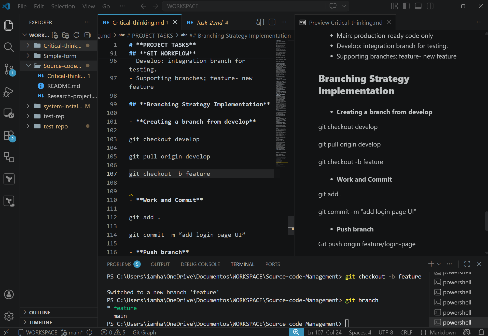

- **Work and Commit**

git add .

git commit -m “add new branch feature”

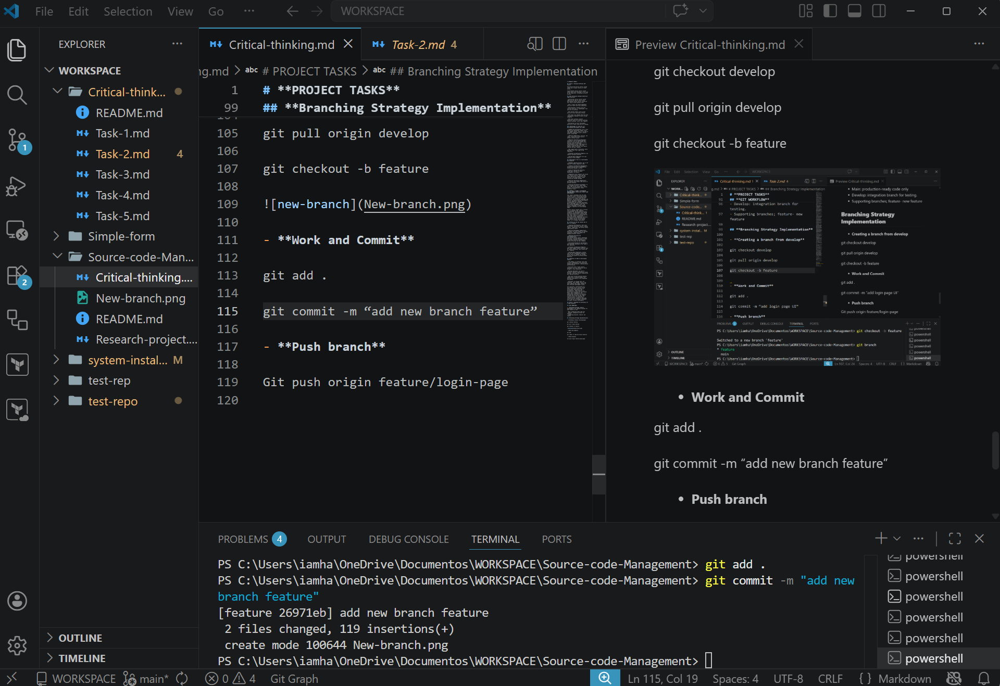

- **Push branch**

Push your branch to the remote repository;
git push origin feature

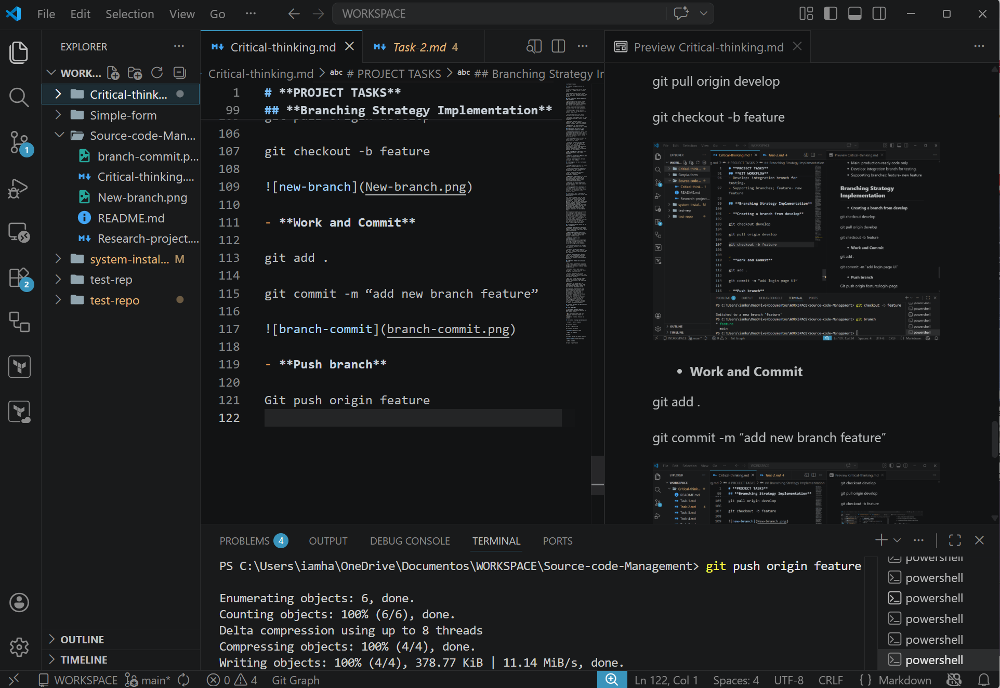

2. **Pull Request (code review)**; Use of platforms like GitHub, Gitlab, Bitbucket.

Process;

- **Open a pull request (PR)**  

From; feature/login-page

To; develop
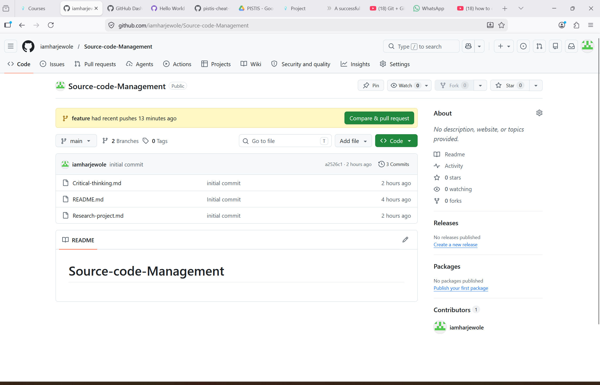

- **Require**;

At least 1-2 reviewers

Code review approval before merge
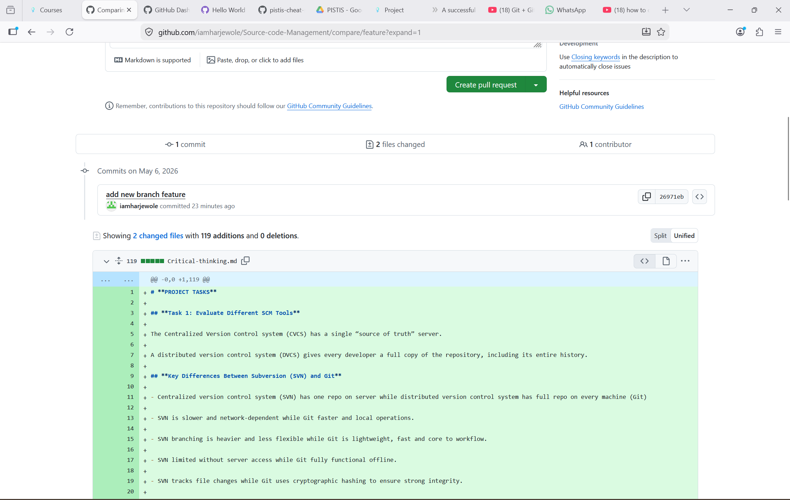
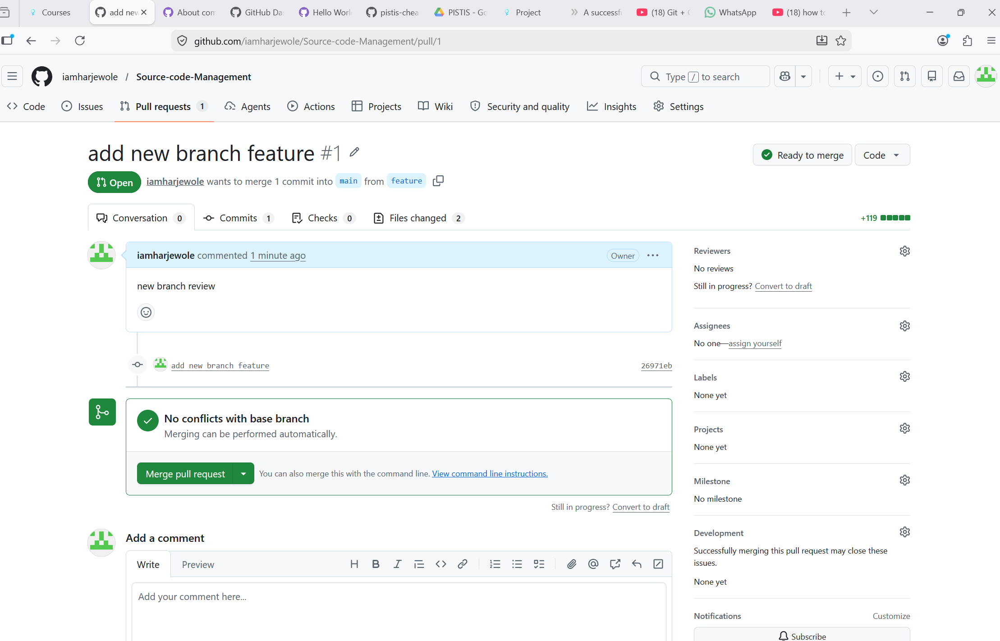

- **Review checklist**;

Code quality

Naming conventions

Security issues  

Performance considerations

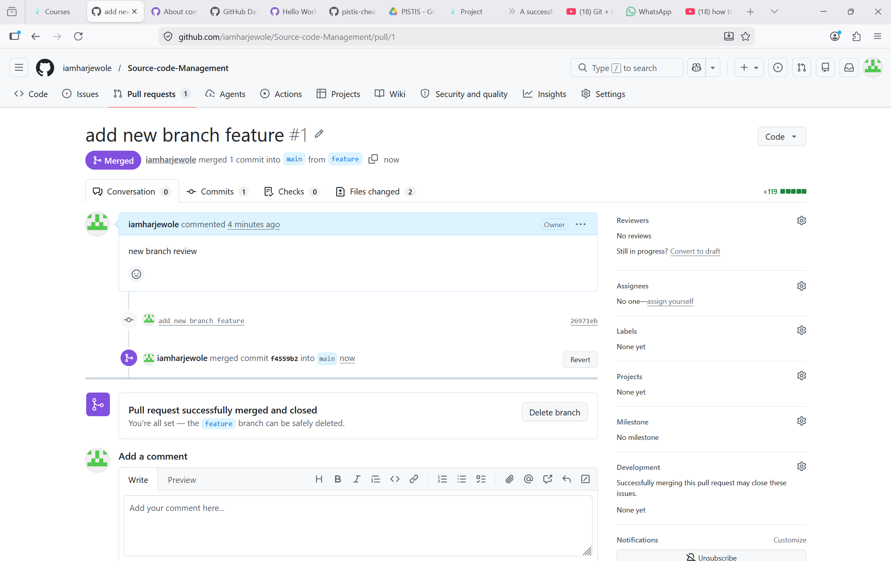

## **WORKFLOW SUMMARY**

- Create feature branch from develop
- Develop and push code
- Open Pull Request
- Run automated integration tests
- Get code review approval
- Merge into develop
- After testing, promote to main

*This workflow is specifically designed to make collaboration smooth and reliable for distributed teams(people working from different locations, time zones or schedules). It turns a scattered group of developers into a coordinated, efficient team working from anywhere without chaos*.

## **Task 3: Automate Code Quality and Deployment

1. **Overview; this CI/CD pipeline automates**;

- Code integration from Git
- Running tests automatically
- Deploying validated code to production

***It ensures***;

- Faster development cycles
- Fewer bugs in production
- Consistent deployment process

2. **Tools Used**

- Version Control : Git
- Repository Hosting; GitHub(or Gitlab/Bitbucket)
- CI/CD Engine; GitHub Actions
- Testing framework; depends on stack (e.g, jest, Pytest)
- Deployment Target; cloud server(AWS, AZure, or VPS)

3. **Pipeline Architecture**; developer-git-push-ci-pipeline-test-build
Flows;

- Developer pushes code to a branch
- Pipeline is triggered automatically
- Tests run
- If test pass-build is created
- Code is deployed to staging/production

4. **CI/CD Pipeline Configuration**;

Create a file; .github/workflow/ci-cd.yml
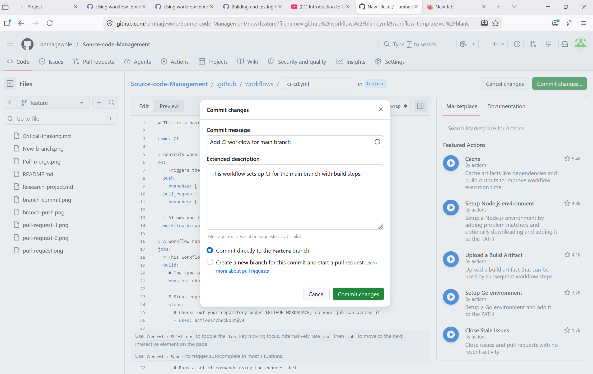
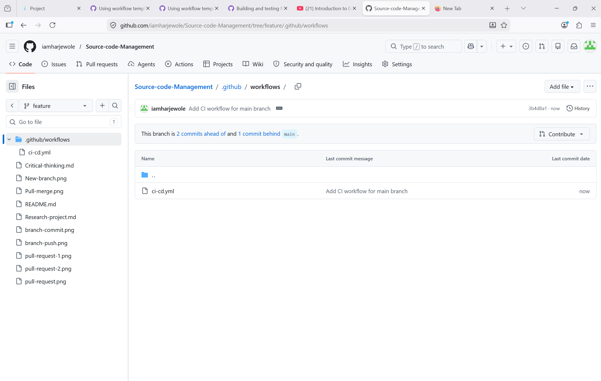

6. **How the Pipeline Works**;

- Code Push; developer pushes code to GitHub
- Trigger; pipeline runs automatically on ; push to main or develop,  pull request to main
- Build Stage; installs dependencies and prepares environment
- Test Stage; Runs automated tests and if tests fail- pipeline stops
- Deploy stage; only run if; tests pass, code is in the main branch.

7. **How to Trigger Tests; test run automatically when**;

- You push code; git push origin develop
- You create a pull request to main

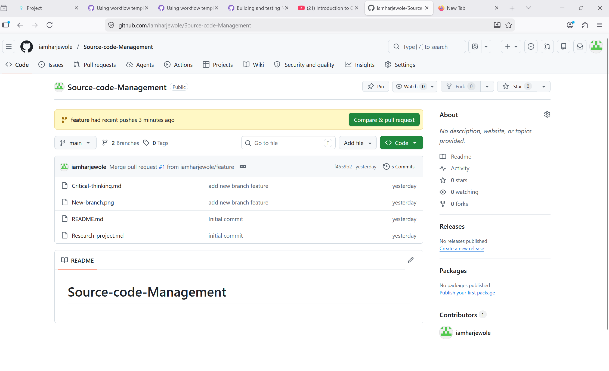

8. **How to deploy New Code**

Automatic deployment; deployment happens when;

- Code is merged into main
- All tests pass

git checkout main

git merge develop

git push origin main

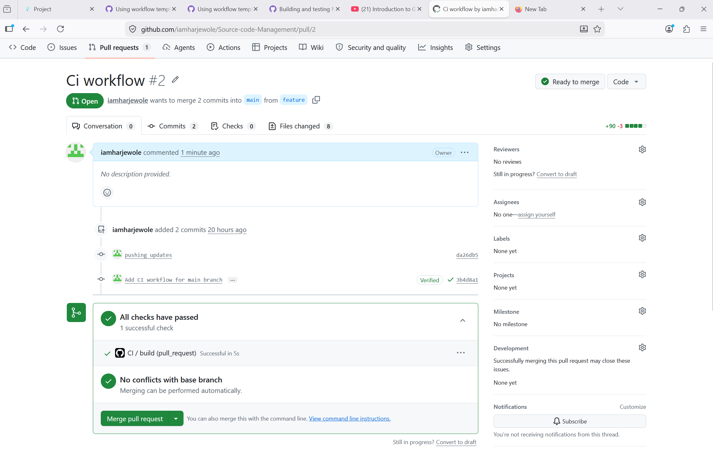

## **How this supports team collaboration**

- Multiple developers can work on features independently
- Automated testing reduces conflicts
- Pull requests ensure code review
- Consistent deployment avoids “ it works on my machine” issues.
